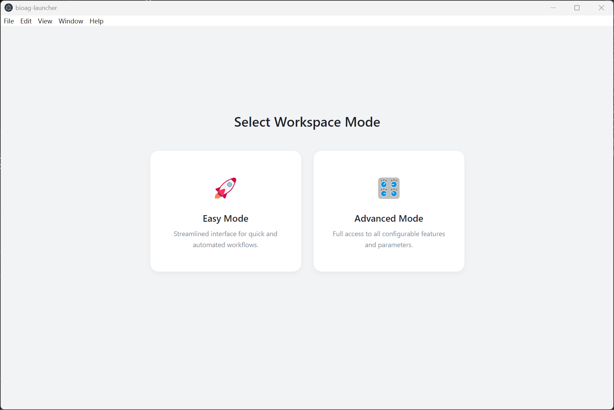

  

<h1 align="center">BioGAIP</h1>
<h3 align="center">**Bio**informatics **G**enerative **AI** **P**latform</h3>
<h3 align="center">AI-Powered Bioinformatics Agent • Turn Natural Language into End-to-end Pipelines</h3>

  
  
  
  

  <strong>No scripting. No conda hell. No 3-day debugging.</strong> 
  Just update your data (to your server) and describe your analysis Natural Language — the AI builds runs, and debug the entire pipeline.

  <a href="quickstart.md"><strong>Quick Start →</strong></a>
  &nbsp;&nbsp;•&nbsp;&nbsp;
  <a href="#✨-why-biogaip">Features</a>
  &nbsp;&nbsp;•&nbsp;&nbsp;
  <a href="#🎯-tested-analyses">Supported Analyses</a>
  &nbsp;&nbsp;•&nbsp;&nbsp;
  <a href="📚-full-documentation">Full Guidelines</a>

---

## ✨ Why BioGAIP

| Feature                    | Traditional Way            | BioGAIP                                   |
| -------------------------- | -------------------------- | ----------------------------------------- |
| **Workflow Creation**      | Write Many lines of Bash/R | Some natural-language paragraph           |
| **Environment Management** | Manual conda/docker        | Fully automatic                           |
| **Data Security**          | -     | Premise (your server and you choosed LLM) |
| **Learning Curve**         | Weeks                      | Hours                                     |

**Result**: From raw FASTQ (RNA-seq) to publication-ready results in hours.

## 🚀 Key Features

Compared to existing solutions, BioGAIP stands out with several distinct advantages:

- **Intuitive User Experience**: We've designed user-friendly interfaces for nearly every scenario—from initial deployment to daily application—ensuring effortless operation for users of all skill levels.
- **Cross-Platform Compatibility**: Powered by containerization, BioGAIP runs seamlessly on Windows, Linux, and macOS. Even without container support, most components can still be run natively across platforms (with minor feature limitations).
- **Broad LLM Backend Support**: Out-of-the-box support for a wide range of LLM APIs, including Grok, Qwen, Gemini, and DeepSeek, alongside full support for custom local models.
- **Secure & Flexible Architecture**: Built on a robust Client/Server (C/S) architecture utilizing `BioWorker` as the server. By leveraging containerization and sandboxing (highly experimental), it delivers exceptional scalability while keeping your sensitive data completely secure.
- **Ultimate Customizability**: Designed with power users in mind. Through a unified configuration file, you can deeply tailor the platform—fine-tuning everything from RAG pipelines and multi-agent teams to hallucination mitigation strategies.
- **Easy Session Sharing**: Easily export and share your analysis sessions with colleagues, fully visualized through an intuitive graphical interface and clear DAGs (Directed Acyclic Graphs).
- **Alchemy Mode**: Seamlessly transform your successful analysis sessions into reusable Agent Skills or Snakemake workflows using the Session Manager toolkit.

## 📸 Demo Video of End-to-end Graphic Deploy

<video controls style="width: 100%; max-width: 100%; display: block; margin: 1rem auto;">
  <source src="./src/Supplement%20video%201.mp4" type="video/mp4">
  Your browser does not support the video tag.
</video>

### Real-World Example (Reanalysis GEO data)
    You are an expert bioinformatician tasked with processing RNA-seq sequencing data from the dataset GSE281525. The data is stored in the directory <input directory>, which includes RNA-seq data for non-metastatic tumor samples (in the subdirectory Never-met_rna_seq) and metastatic tumor samples (in the subdirectory Met_rna_seq). 
    The human reference genome hg38 and its corresponding GTF annotation file are available in <reference genome direcrory>.
    Perform the following pipeline steps on the data:
    
    1. Conduct quality control (QC) using appropriate tools such as FastQC or MultiQC.
    2. Align the reads to the hg38 reference genome using STAR.
    3. Quantify transcripts using featureCounts.
    4. Perform differential expression analysis using DESeq2 to identify genes with differential expression between non-metastatic (Never-met_rna_seq) and metastatic (Met_rna_seq) tumor samples.
    
    All outputs must be saved in <output directory>. 
    If you need to create or manage environments (e.g., Conda envs), store them in <env directory>.
    
    You have access to <cpu number> CPU cores for parallel processing where applicable.
    Expected Outputs:
    
    1. Aligned BAM files for each sample.
    2. Transcript quantification results (e.g., count matrices).
    3. A list of differentially expressed genes, including fold changes, p-values, and adjusted p-values.

→ AI downloads creates envs, runs everything, saves BAMs + DE gene table + MultiQC report.

📸 Video: 

<video controls style="width: 100%; max-width: 100%; display: block; margin: 1rem auto;">
  <source src="./src/Supplement%20video%202%20mini.mp4" type="video/mp4">
  Your browser does not support the video tag.
</video>

---

## 🚀 Quick Start (Literally few hours)

BioGAIP typically runs in C/S (Client/Server) mode. BioAG, running in client mode, supports various computing platforms (e.g., local Windows 10/Linux computers), while BioWorker needs to be deployed on the user's computing resources, such as Linux servers or HPC. Typically, the local side and server side need to meet the following conditions:

### Local Side:
- ~~A computer running Windows 10/11 (For computers running Linux, it must be started from source code).~~
- ~~Virtualization must be enabled in BIOS (Recommend, but optional) \*\*. (For most OEM computers, this should be enabled by default. To check if it is enabled, please refer to: [https://stackoverflow.com/questions/49005791/how-to-check-if-intel-virtualization-is-enabled-without-going-to-bios-in-windows](https://stackoverflow.com/questions/49005791/how-to-check-if-intel-virtualization-is-enabled-without-going-to-bios-in-windows)).~~
- The computer should have 10GB of free space and 8GB of RAM (although it may run on devices with only 4GB of RAM).
- The computer should be able to communicate with the computing server.

### Server Side:
- Running Linux operating system\*.
- Docker installed as the underlying containerization technology\*\*.
- Firewall port for BioWorker communication (default is 38000) must be open.

\* This option can be bypassed; for example, you can actually run BioWorker on a Windows platform, which requires more complex configuration. As the number of users with this need is small, we do not provide support or documentation for this workaround; please refer directly to the BioGAIP code for technical details.

\*\* This option is strongly recommended, but you can use alternatives to bypass this requirement without affecting the main functions of BioGAIP. However, this will greatly increase the difficulty of configuration beyond the scope of this Quick Start. Please refer to the documentation for more details.

Configuration Steps:
If your devices meet the above requirements, follow these steps to get started:

~~1. Refer to the [Quick Config.mp4](./Quick%20Config.mp4) included in this repository to quickly configure your computer (**Optional**)~~.
2. **Upload** Your data to your Linux server (Winscp/filezilla)
3. **Launch** After the quick configuration is complete, unzip `bioag-launcher-win32-x64-*.*.*.zip` and double-click `bioag-launcher.exe` to start the setup wizard, Select Easy Mode.
4. **Configure** BioLauncher will guide the user through the initial configuration of BioAG.
5. **Connect** After step 3 is completed, BioLauncher will guide the user to connect to BioWorker. If you have a configured BioWorker instance, you can connect directly by entering the API URL and Key. If you do not have a configured BioWorker instance, you can choose to use SSH connection for initialization; BioAG will attempt to automatically complete the BioWorker configuration on the target server via SSH.
6. Paste **prompt** → **Run**  
7. **Done.** The AI agent takes over.

~~We strongly suggest users watch Videos 1 and 2 in the supplementary materials of our manuscript for video guides regarding steps 2-4~~.

**Detail Quick Start Guide** available at [here](quickstart_v2.md)

**Configure File Template** is available [here](./configure.yaml).
(If not download automatic, please use save as, or press `Ctrl + S`)

---

## 🎯 Tested Analyses

- **Bulk RNA-seq** (QC, Aligement, DE, pathway, volcano plots)  
- **ATAC-seq / ChIP-seq** (QC, Aligement,peak calling)  
- **scRNA-seq** (QC, Seurat/CellRanger, clustering, markers)  
- **WGS** (QC, Aligement, variant calling)
- **Custom pipelines** — just describe them!

All tools (STAR, DESeq2, CellRanger, MACS2, etc.) are auto-installed in isolated conda environments.

---

## 🛡️ Security & Architecture

- **Client-Server mode**: Your raw data **never** leaves your server  
- **AGPL-3.0** open source (audit everything)  
- **Docker + sandbox** isolation (sandbox is highly experimental)
- **High customization** for Advanced user

---

## 📊 What the Community Says

> ^_^

---

## 📚 Full Documentation

**[Guidelines](https://notebook.biogaip.top)** → Detailed guide with screenshots, prompt templates, troubleshooting, and server config examples.

---

## 🤝 Contributing & Community

We welcome:
- LLM prompt improvements  
- Bug reports  
- Feature requests

**Star ⭐ this repo** if you want the bioinformatics world to finally catch up with AI!

---

# Milestones & Roadmap

We are building the future of AI-driven bioinformatics — one milestone at a time.  
Here’s our transparent roadmap:

| Milestone | Target Date | Priority | Status | Key Achievements & Goals | Notes |
| :--- | :--- | :--- | :--- | :--- | :--- |
| **v1.31 — Public Beta** | March 2026 | Normal | ✅ Released | First public beta release | - |
| **Optimized User-Defined Tools Support** | - | Normal | ⏳ Planned | Provide a GUI for user-defined tools | - |
| **Optimized Logger System** | - | Normal | ✅ Released | Provide session-level export functionality for BioWorker | - |
| **Universal MCP Support for BioWorker** | - | Low | ⏳ Planned | - | - |
| **Session Explorer Suites** | - | High | ✅ Beta | Provide a cross-platform GUI tool for session sharing | - |
| **Upgrade AutoGen Framework** | - | Normal | ⏳ Planned | - | - |
| **Batch Mode** | - | Normal | ⏳ Planned | - | - |
| **GUI Session Import/Export** | - | Normal | ✅ Beta | Provide full import/export functionality for the current session in the BioAG UI | - |
| **Alchemy Mode** | - | High | ✅ Beta | - | - |
| **User-Space Virtualization Support** | - | Normal | 🛠️ Work in Progress | Provide full user-space virtualization for BioWorker based on the KVM framework | - |
| **Easy Setup Mode (BioLauncher)** | - | Normal | ✅ Beta | Provide an easy-to-use graphical configuration mode for non-expert users | - |
| **BioWorker User Group Management** | - | Normal | 🛠️ Work in Progress | - | - |
| **Slurm Support in BioWorker** | - | Normal | ❓ Proposed | - | - |
| **Session-to-DAG Visualization Support**| - | Normal | ✅ Beta | - | - |
| **Python pip packages**| - | Normal | ✅ Beta | Provide a simple pip installation method for BioAG | - |
| **Online Session Visualization Tool**| - | Normal | ❓ Proposed | - | - |

**Want to influence the roadmap?**  
Star ⭐ the repo and open an [issue](https://github.com/zhangjy859/BioGAIP/issues) — every suggestion is welcome!

---

## 😲Known Limitation

- ~~Windows: RAG is unavailable without containerization due to `tqdm` output issues.~~ (Solved)
- Windows: Without containerization, outputs from certain LLMs may not be parsed correctly by the frontend. This does not affect task execution itself but degrades the user experience.
- All: Users may be unable to log in via Firefox under certain conditions. (Solved?)
- BioWorker: Task statuses may fail to update in real-time under specific circumstances. (Solved?)
- Edge Browser: Efficiency Mode (battery saver) may cause long-running tasks to freeze. (Unresolved, mitigations applied)
- BioLauncher: When automatically deploying BioWorker, BioLauncher may fail to correctly display the deployment progress.
  

## 📨 Contact

If you have any question, please feel free to open an [issue](https://github.com/zhangjy859/BioGAIP/issues), or send mail to zhjiayu\*outlook.com (Please replace \* with @)

## 📝 Historical Note: BioGen vs. BioGAIP

BioGAIP was originally developed under the internal codename **BioGen** during our v1.0 cycle. While we officially rebranded to BioGAIP starting with v1.3, the internal codebase migration is still an ongoing process. 

As a result, you may still spot `BioGen` or `biogen` used in variable names, module paths, and legacy code segments. These references are completely normal and do not affect functionality.

 

## License
This project is licensed under a Dual License model:
1. [AGPL-3.0](https://www.gnu.org/licenses/agpl-3.0.en.html) License: You can use this software under the terms of the GNU Affero General Public License version 3.0. If you build a commercial or non-commercial application using this project, you must comply with all AGPL-3.0 terms, which includes making your entire application's source code open and available under the same license.
2. Commercial License: If you wish to use this software in a proprietary or closed-source application, or if you cannot comply with the AGPL-3.0 requirements, you must request a commercial license.

**Disclaimer**

THERE IS NO WARRANTY FOR THE PROGRAM, TO THE EXTENT PERMITTED BY APPLICABLE LAW. EXCEPT WHEN OTHERWISE STATED IN WRITING THE COPYRIGHT HOLDERS AND/OR OTHER PARTIES PROVIDE THE PROGRAM "AS IS" WITHOUT WARRANTY OF ANY KIND, EITHER EXPRESSED OR IMPLIED, INCLUDING, BUT NOT LIMITED TO, THE IMPLIED WARRANTIES OF MERCHANTABILITY AND FITNESS FOR A PARTICULAR PURPOSE. THE ENTIRE RISK AS TO THE QUALITY AND PERFORMANCE OF THE PROGRAM IS WITH YOU. SHOULD THE PROGRAM PROVE DEFECTIVE, YOU ASSUME THE COST OF ALL NECESSARY SERVICING, REPAIR OR CORRECTION.

