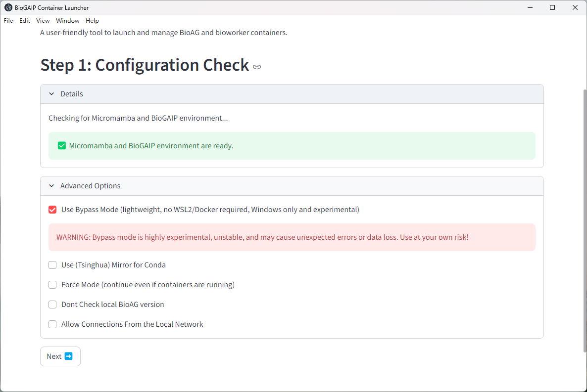
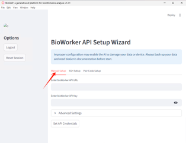

### Run BioGAIP
BioGAIP offers flexible and versatile deployment options. While the [Quick Start](quickstart_v2.md) guide walks you through getting started with pre-compiled binaries for Windows, this page introduces a variety of alternative methods to help you deploy the software according to user specific needs.

#### Deployment via BioLauncher
BioLauncher is an all-in-one deployment assistant featuring a Graphical User Interface (GUI). It allows you to seamlessly configure and install all components of BioGAIP in a single place. Given its convenience, this is our recommended deployment method and the first one we introduce.

BioLauncher features excellent cross-platform compatibility, supporting Windows, macOS, and Linux. It has been rigorously tested on Windows and Linux, and we provide best-effort support for macOS.

Since BioGAIP is primarily developed in Python, it relies on various dependencies. To prevent frustrating dependency conflicts, BioLauncher employs two main approaches:

1. **Easy Mode (Default):** This is currently the most streamlined and fastest setup method. While it lacks certain advanced customization options, users can ideally complete the configuration in just a few minutes.

2. **Containerized Mode:** In this mode, BioGAIP components run using containerization technologies (such as Docker or experimental Singularity support). For Docker, it utilizes native Docker on Linux, and Docker Desktop or WSL2-driven Docker containers on Windows. This approach ensures an isolated, stable, and reproducible runtime environment.

3. **Local / Bypass Mode:** This is a more lightweight approach. Instead of relying on container engines, BioLauncher uses Micromamba to build an isolated local runtime environment for BioGAIP. This eliminates the need for containerization and significantly reduces local resource consumption.

Regardless of the execution mode you choose, BioLauncher independently manages its runtime environments, ensuring non interference with user existing system and local workspace.

>[!WARNING]
> 
> Bypass mode requires the Microsoft Visual C++ 2015 Redistributable for Windows 10/11. While this is already installed on most Windows machines, you may need to install it if it's missing. 
>
> You can download the redistributable from https://www.microsoft.com/en-us/download/details.aspx?id=48145

<br>

> [!WARNING]
> 
> Since Easy Mode provides a more streamlined installation process, lower system requirements, and numerous bug fixes, we are considering replacing Bypass Mode with it entirely.
> 
> In the future, Bypass Mode may be restricted to development purposes only.
>

By default, when using **Easy Mode**, BioLauncher relies entirely on built-in executables to run BioAG. On supported systems, no additional configuration or setup is required.

In **Advanced Mode**, BioLauncher automatically searches for Docker Desktop or the Docker client within WSL2 (Windows only) to serve as the backend. If you prefer not to use Docker, you can select **Bypass Mode** during the initial configuration check in the GUI.




##### BioLauncher (Windows)
The best way to run BioLauncher on Windows is by using our pre-compiled binary package. The guide for this approach can be found in the [Quick Start](quickstart_v2.md). However, if you prefer more granular control, such as running BioLauncher from source, the following guide may be helpful.

>[!WARNING]
> 
> This section is intended for advanced users. For most users on Windows, running the pre-compiled binaries is usually sufficient.

1. Install npm
   You will need to install npm on your system (if you haven't already).

   **Installing npm:**
   You can download npm via the following link: https://github.com/coreybutler/nvm-windows/releases

   Please select the installer named `nvm-setup.exe`. 
   We highly recommend restarting your computer after the installation is complete.

2. Download the Source Code:
   You can download the source code package from our Zenodo or GitHub page. Typically, the package is named `BioGAIP-source-version.zip` or something similar.

   Once downloaded, extract the package to a location of your choice. On modern operating systems, `.zip` files can usually be extracted directly using the built-in file manager.

   After extraction, use the file manager to navigate to the `bioGen\script\windows_gui` directory, and open a Windows Terminal (PowerShell) in this directory.

> [!TIP]
> 
> On Windows 11, you can easily open a terminal by right-clicking on an empty space within the file manager and selecting `Open in Terminal`.

<br>
> [!TIP]
> 
> !!! Important !!!
>
> In the following sections, unless specified otherwise, any mention of the word "terminal" refers to this specific terminal window (open in `bioGen\script\windows_gui`)!

3. Install npm and Python Dependencies
   You will need to install Python for your system.
   On the Windows platform, BioLauncher does not use the system's global Python environment. Instead, it defaults to using a standalone executable.

   **Installing Python:**
   - Download the standalone Python executable package from [here](https://github.com/astral-sh/python-build-standalone/releases/download/20250828/cpython-3.12.11+20250828-x86_64-pc-windows-msvc-install_only.tar.gz).
   - Open the archive using `7-Zip`, `WinRAR`, or a similar archive manager. When you first open the archive, it may display a file named `cpython-3.12.11+20250828-x86_64-pc-windows-msvc-install_only.tar`. Keep double-clicking to open it until you see a folder named `python`.
   - Drag and drop (or copy) this `python` folder into the `bioGen\script\windows_gui` directory that you opened in step 2.
   - Execute the following commands in the terminal (indented lines below represent code execution):
    ```
       python\python.exe -m pip install streamlit pyyaml psutil
       npm install
    ```

4. Start BioLauncher
   Continue by running the following command to start BioLauncher:
    ```
       npm start
    ```


##### BioLauncher (macOS)
###### A Note Regarding macOS Pre-compiled Binaries

We have continuously strived to provide pre-compiled binaries for macOS. Unfortunately, Apple requires these binaries to be cryptographically signed (which necessitates a paid developer certificate). Without this signature, macOS will flag the application with a "file is damaged" error. During our internal testing, this led to significant user frustration and misunderstanding.

While there are workarounds available (such as modifying the binary's quarantine attributes via the terminal), BioGAIP consists of multiple independent binaries for its various components. This means users would have to repeat the workaround multiple times, resulting in a highly frustrating user experience.

As a result, we have temporarily suspended the release of pre-compiled binaries for macOS. However, you can still easily run BioLauncher from the source code by following the steps below.

1. Install npm
   - Press `Command + Space` to open Spotlight Search, type `Terminal`, and press Enter to launch it.
   - If you do not have `Homebrew` installed, please refer to this [link](https://brew.sh/) to install it.
   - Once the Terminal is open, use the following commands to install npm (indented lines below represent code execution):
       ```
       brew install node
       brew install npm
       ```
   - Close the terminal when finished.

2. Download the Source Code:
   You can download the source code package from our Zenodo or GitHub page. Typically, the package is named `BioGAIP-source-version.zip` or something similar.

   Once downloaded, extract the package to a location of your choice. On modern operating systems, `.zip` files can usually be extracted directly using the built-in file manager.

   After extraction, use Finder to navigate to the `bioGen/script/windows_gui` directory. 
   
   Open a terminal in this specific folder by navigating to the Finder menu bar: **Finder → Services → New Terminal at Folder**.

3. Configure Python
   On macOS, using a standalone Python executable can cause unexpected issues, so we use a `venv` (virtual environment) instead.
   In the terminal you just opened in Step 2, execute the following commands in sequence:
       ```
       python3 -m venv venv
       source venv/bin/activate
       python -m pip install streamlit pyyaml psutil
       mkdir python
       ln -s $(which python) python/python
       ```

4. Install npm Packages
   Still in the same terminal, execute the following command:
```
       npm install
```
5. Start BioLauncher
   Continue by running the following command to start BioLauncher:
    ```
       npm start
    ```


##### BioLauncher (Linux)
For Linux platforms, the startup process is almost identical to macOS. The main difference is that on most Linux distributions, Python and npm might already be installed.

If npm is not installed, it can typically be installed via `nvm` using the following commands (indented lines below represent code execution):

    curl -o- https://raw.githubusercontent.com/nvm-sh/nvm/v0.40.1/install.sh | bash
    # If you use bash:
    source ~/.bashrc
    # If you use zsh:
    source ~/.zshrc

1. Download the Source Code:
   You can download the source code package from our Zenodo or GitHub page. Typically, the package is named `BioGAIP-source-version.zip` or something similar.

   Once downloaded, extract the package to a location of your choice. On modern operating systems, `.zip` files can usually be extracted directly using the built-in archive manager.

   After extraction, use your file manager or terminal to navigate to the `bioGen/script/windows_gui` directory. 
   
   Open a terminal in this specific folder.

2. Configure Python
   On Linux, you can use a `venv` (virtual environment) just like on macOS. In the terminal you just opened in Step 1, execute the following commands in sequence:

       python3 -m venv venv
       source venv/bin/activate
       python -m pip install streamlit pyyaml psutil
       mkdir python
       ln -s $(which python) python/python

   Alternatively, for Linux platforms, you can use a standalone Python executable, which can be downloaded from [here](https://github.com/astral-sh/python-build-standalone/releases/download/20250828/cpython-3.11.13+20250828-x86_64-unknown-linux-gnu-install_only.tar.gz). 
   You will need to extract the downloaded file into the `bioGen/script/windows_gui` directory, and then execute:

       ./python/python -m pip install streamlit pyyaml psutil

3. Install npm Packages
   Still in the same terminal, execute the following command:

       npm install

4. Start BioLauncher
   Continue by running the following command to start BioLauncher:

       npm start

#### BioWorker Deployment

The core components of BioGAIP, `BioAG` and `BioWorker`, operate in a Client/Server (C/S) architecture by default (please refer to our manuscript for more details). Once `BioLauncher` completes the configuration and startup of `BioAG`, it will seamlessly guide you into the BioWorker configuration mode.

<center>
    
</center>

This mode offers two primary configuration options to choose from:

- **Manual setup:** This option allows you to configure the HTTP API and API Key for an existing BioWorker. It is ideal for situations where you already have a BioWorker instance up and running.

- **SSH setup:** This option allows you to input remote server details, such as the Username and IP address. Using these credentials, `BioAG` will automatically configure and deploy a new `BioWorker` instance on the server side via SSH.

#### Video Guide

<video controls style="width: 100%; max-width: 100%; display: block; margin: 1rem auto;">
  <source src="./src/Supplement%20video%201.mp4" type="video/mp4">
  Your browser does not support the video tag.
</video>

<br>


#### Manual Deployment

Please refer to the [Advanced Configuration](Advanced.md) section.