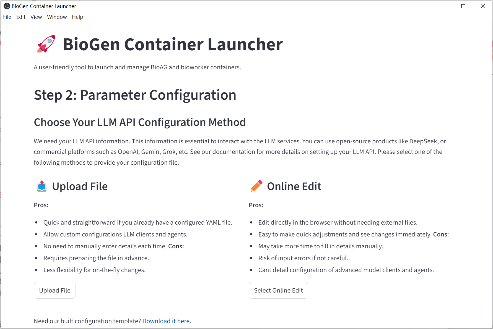

# Quickstart

## Before You Begin

BioGAIP consists of three main components: **BioAG** , **BioWorker** and a graphic deploy tool (**BioLauncher**).

- **BioAG** is the cross-platform Agents platform for the agent workflows. It runs on Windows, Linux, and macOS (macOS support is functional but not exhaustively tested).
- **BioWorker** is a security-first execution agent that communicates with BioAG over a Web API, forming a client-server architecture. Full functionality is available only on Linux; advanced users may run it on macOS or Windows (via WSL) with some limitations.

Both components are container-based by default, providing the highest levels of isolation and performance. For users who prefer a simpler setup, non-containerized execution is supported experimentally.

BioGAIP is deliberately designed to require minimal configuration and no programming knowledge. The graphical configuration wizard **BioLauncher** guides users through all initial setup steps.

>[!WARNING]
> 
> BioLauncher support multiple platforms. However, at present, we only provide **pre-compiled binary versions** for the Windows 10/11. 
> We are currently attempting to expand the support for binary versions.
> 

## Deployment Mode

BioGAIP's core components are highly decoupled, offering maximum flexibility in how you spin up your environment. Here are the three primary deployment topologies:

### 1. Classic Deployment (Client/Server) 🌟 *Recommended*
In this architecture, **BioWorker** runs on dedicated compute resources (e.g., a remote server or HPC cluster) and exposes its services via an API. Meanwhile, **BioAG** is installed on the user's local machine, acting as a lightweight agents client.

**Why we recommend it:**
- **Controllable:** Enforces strict file access controls on BioWorker (with CPU/memory quotas planned for future releases).
- **Convenient:** A single BioWorker backend supports multi-sessions, meaning one server can power BioAG clients for an entire lab.
- **Highly Flexible:** End-users retain full control over their local BioAG client, allowing for deep, personalized customization.
- **Secure by Design:** Minimizes the attack surface. The BioWorker API is a standard HTTP service, meaning you can easily lock it down using reverse proxies, SSL/TLS, and standard firewalls.
- **Frictionless Setup:** As our primary supported mode, the graphical deployment wizard will get you up and running in roughly 20 minutes.

### 2. SaaS Deployment (Web Service Mode)
Both BioAG and BioWorker are hosted on a central server (also can be deployed separately). BioAG leverages its built-in authentication and session manager to act as a web-based Software-as-a-Service (SaaS), allowing users to log in via a browser.

**Advantages:**
- **Zero Client Configure:** Admins handle the heavy lifting; end-users only need a web browser.
- **Centralized Management:** Unified configuration and seamless updates.

**Trade-offs & Risks:**
- **Security Implications:** BioAG was engineered assuming a trusted local execution environment, it is *not* a hardened public web server. Exposing it directly to the web significantly increases your attack surface. While containerization offers some mitigation, comprehensive web-facing security is currently out of scope for this project.
- **Limited Multi-sessions (users) Manager:** Multi-user isolation in BioAG is currently "best-effort." Achieving strict, production-grade user isolation requires complex custom scripts which we do not currently open-source.

### 3. Local Deployment (Standalone Mode)
A localized variation where both BioAG and BioWorker run simultaneously on the user's local machine (laptop or workstation). While it eliminates the need for external servers, it demands substantial local hardware resources.

> [!CAUTION]
> 
> To ensure the best experience, our **Quickstart** guide focuses exclusively on the **Classic Deployment (Client/Server)** method.

 

>[!IMPORTANT]
> If the system configuration meets the requirements, BioLauncher can guide users through the configuration process automatically in a graphical manner.

## System prerequisites

The default architecture allows **BioAG** and **BioWorker** to run on separate machines:

- **BioAG** (client) typically runs on the user’s local workstation or laptop.
- **BioWorker** (server) runs on dedicated compute resources such as a remote server, cloud instance, or HPC cluster.

This separation provides the best combination of usability, performance, and security.

While it is technically possible to run both components on the same machine, this configuration is **not recommended** for production use due to reduced isolation and resource contention.

The quick-start guide and **biolauncher** wizard assume the standard client–server deployment described above and will guide you through that setup by default. Custom (e.g., single-machine) configurations are supported but require manual adjustments after the initial setup.

### Recommended System Configuration

#### BioAG (Local Machine)
---

| Item                      | Recommended        | Minimum                    |
| ------------------------- | ------------------ | -------------------------- |
| Operating System          | Windows 10/11      | Windows 10 / macOS / Linux |
| RAM                       | 32 GB              | 16 GB¹                     |
| Free system disk space    | >50 GB             | >20 GB                     |
| Architecture              | x86/64             | x86/64                     |
| Internet access²          | Required           | Required                   |
| WSL2³                     | Required           | Not required               |
| Virtualization            | Required (WSL2)    | Not required               |
| Docker (containerization) | Required (in WSL2) | Not required               |

¹ <16 GB is possible but not fully tested and may be heavily limited.  
² Must reliably reach: github.com, huggingface.co, hub.docker.com.  
³ On Windows we strongly recommend WSL2.

### 🛠️ Windows System Checker

To ensure a frictionless setup on Windows 10/11, we've built a lightweight pre-flight utility to instantly verify your system environment.

📥 **[Download the System Checker](http://nondisk.136138189.xyz:2086/s/9LIA/e40c6x3x)**

**How to use it:**
1. Simply download and double-click the executable.
2. The tool will run an automated diagnostic scan of your hardware and software configurations. 
3. If your system hits all the targets, every metric will display an **Optimal** status, looking something like this:

If your environment falls short of the requirements, the tool will flag the exact issues and provide **Suggestion**, alongside direct links to helpful documentation to get you up to speed.

> [!TIP]
> **Pro Tip:** We highly recommend resolving all warnings until your system reads **Optimal** across the board, with the possible exception of RAM. While boosting RAM requires a physical hardware upgrade, software misconfigurations (like missing WSL2, Docker issues, or low disk space) are quick fixes that will drastically improve your BioGAIP experience and stability.

---

#### BioWorker (Remote Server – Ubuntu Example)

| Item                   | Recommended                                    | Minimum                         |
| ---------------------- | ---------------------------------------------- | ------------------------------- |
| Operating System       | Ubuntu 18.04 / CentOS 7 or newer (kernel >3.4) | Any Linux                       |
| RAM                    | Task-dependent                                 | Task-dependent                  |
| Free system disk space | >20 GB                                         | >10 GB                          |
| Architecture           | x86/64                                         | x86/64 or others (experimental) |
| Internet access¹       | Required                                       | Required                        |
| Docker                 | Required                                       | Recommended                     |
| Sandbox support        | —                                              | Recommended                     |

¹ Server must reach hub.docker.com and other sites (please refer to [Network Requirements](#network-requirements)).

Under the **recommended** server configuration, BioGAIP automatically completes all server-side setup. Minimum configuration may require manual advanced steps.

- **Docker Engine**, rootless Docker, or Singularity/Apptainer installed [(Without packages rootless docker](https://docs.docker.com/engine/security/rootless/) is also accpectable)
- **SSH access credentials** for a non-root user (IP/hostname, port, username, password or key)
- All the files required for the analysis task (if have) must be uploaded to the **Remote server** in advance. 
  This guide below assumes that all the files are uploaded to `/mnt/data1/BioGAIP_test`, and all the outputs are written to `/mnt/data1/BioGAIP_test` for example

> [!TIP]
> 
> BioGAIP does not yet include built-in file upload or download functionality for end users. In client-server (C/S) deployments, this means you'll need to manually transfer files to the server side.
> 
> The good news? Popular tools like [FileZilla](https://filezilla-project.org/) and [WinSCP](https://winscp.net/) make the process quick and painless.
> 
> We're actively exploring more seamless, user-friendly solutions for future releases.
>
> Need more help uploading files? Check out these third-party tutorial videos:
>
> - **[FileZilla Tutorial: How To Connect To Server And Upload Files](https://www.youtube.com/watch?v=tHJ0ISOspRc)** (YouTube)  
> - **[WinSCP 使用教程（Linux远程上传文件）](https://www.bilibili.com/video/BV1C5411o7h6?p=6&spm_id_from=333.788.videopod.episodes)** (Bilibili – see section 2.4)

**Note for Docker users**: 

The SSH user must be able to run docker commands without sudo. The simplest approach is to add the user to the docker group (`sudo usermod -aG docker $USER`). This requirement does **not** need to rootless Docker or Singuality.

#### Network Requirements

   A stable, unrestricted internet connection is required. The following domains must be reachable without intermittent failures or excessive latency:

   1. github.com and raw.githubusercontent.com
   2. docker.io / registry-1.docker.io
   3. *.huggingface.co
   4. *.anaconda.com and repo.anaconda.com
   5. micro.mamba.pm
   6. The API endpoints of any LLM providers you intend to use (e.g., api.openai.com, api.anthropic.com, etc.)

   If access to any of these services is unreliable or blocked, BioGAIP may still start, but image/model downloads and package installation will be extremely slow or fail in unpredictable ways, making troubleshooting difficult.

**Mitigation options** (available in BioLauncher):

   - HTTP/HTTPS proxies can be configured for BioAG traffic
   - Conda/mamba mirrors can be set for package downloads

   These workarounds apply **only** to BioAG; BioWorker runs inside and cannot use the host’s proxy settings automatically.

### Minimum System Configuration

>[!WARNING]
> 
> Warning: Minimum system configurations are highly experimental and may be unstable or fail entirely. Starting with BioGAIP 1.2.9, minimum mode replaces full containerization with lightweight sandboxing technology, dramatically reducing both hardware requirements and setup complexity.
> 

#### BioAG (Local Machine – Windows Example)

   - Windows 10 or later
   - ≥ 8 GB RAM and ≥ 20 GB free disk space

#### BioWorker (Remote Server – Ubuntu Example)
	- SSH access credentials for a non-root user (IP/hostname, port, username, password or key)
	- All the files required for the analysis task must be uploaded to the Remote server in advance. This guide below assumes that all the files are uploaded to ~/BioGAIP/data/input, and all the outputs are written to ~/BioGAIP/data/output for acceptance

#### Network Requirements

   A stable, unrestricted internet connection is required. The following domains must be reachable without intermittent failures or excessive latency:

   1. github.com and raw.githubusercontent.com
   2. docker.io / registry-1.docker.io
   3. *.huggingface.co
   4. *.anaconda.com and repo.anaconda.com
   5. micro.mamba.pm
   6. The API endpoints of any LLM providers you intend to use (e.g., api.openai.com, api.anthropic.com, etc.)

### Quick Start with Recommended System Configuration

**Note:** This wizard only works when your system meets the recommended configuration requirements. If you prefer to begin with the minimal system configuration, please read the next section first.

#### 🎥 Video Guide
We’ve created a clear, step-by-step demo video that shows exactly how to deploy BioGAIP quickly using BioLauncher. Watch it directly on this page (embedded and fully playable):

<video controls style="width: 100%; max-width: 100%; display: block; margin: 1rem auto;">
  <source src="./src/Supplement%20video%201.mp4" type="video/mp4">
  Your browser does not support the video tag.
</video>

#### Install Docker on Windows
To achieve the best ***performance**, we expect users to install Docker on their devices. For Windows 10/11 users, please refer to the link below:
[https://learn.microsoft.com/en-us/windows/wsl/tutorials/wsl-containers](https://learn.microsoft.com/en-us/windows/wsl/tutorials/wsl-containers)

We have prepared a video to demonstrate the installation process.
<video controls style="width: 100%; max-width: 100%; display: block; margin: 1rem auto;">
  <source src="./src/Quick%20Config.mp4" type="video/mp4">
  Your browser does not support the video tag.
</video>

#### Detail Steps
1. **Download and launch BioLanucher**  
   Biolanucher is a fully integrated, one-stop configuration wizard. Download the latest version [here](http://nondisk.136138189.xyz:2086/s/WvUQ/6s8ys8st). After downloading, extract the archive to any convenient location. Inside you’ll find `biolanucher.exe` — simply double-click it to start (the first launch may take up to 30 seconds).

2. **Software License Agreement**  
   To proceed, you must accept the software license agreement.

3. **System Configuration Check**  
   biolanucher automatically verifies that your system meets the recommended requirements. When everything checks out, you’ll see the screen below. Click **Start** to continue.

4. **LLMs Parameter Configuration**  
   This screen lets you configure the LLMs APIs you’ll use. We strongly recommend uploading a configuration file (the fastest and safest method). A ready-to-use template is available [here](./src/configure.yaml).

   

   **Note:** The preset file includes multiple model clients to demonstrate mixing different LLMs providers. If you’re using a single API, simply enter the same values across all entries.

   **Tips:** Many affordable commercial LLMs APIs are now available, including:

   - [OpenAI](https://platform.openai.com/settings/organization/api-keys)
   - [DeepSeek](https://api-docs.deepseek.com/)
   - [Grok](https://x.ai/api)
   - [Gemini](https://ai.google.dev/gemini-api/docs/api-key)
   - [Qwen](https://help.aliyun.com/zh/model-studio/get-api-key)

   To configure any provider correctly, you’ll need three pieces of information:

   - **Endpoint URL / Base URL** — e.g. `https://api.openai.com/v1/` for OpenAI
   - **API Key** — your secret key
   - **Model Name** — the exact model identifier you want to use

   **⚠️ Important:** Always keep your API keys private. BioGAIP handles them locally and never sends them anywhere. Leaking a key — especially with post-paid services like Gemini — can result in serious charges.

   **Advanced users:** You can also run locally deployed LLMs on your own hardware. BioGAIP maintains broad compatibility with the majority of local and remote LLM APIs.

> [!TIP]
> **Recommended API Providers**  
> We don’t endorse any single provider. The best choice always depends on your specific tasks — we encourage quick testing to find the perfect fit.  
> In our own benchmarks, **Qwen** and **Grok** are the two we use most often.

5. **BioAG Runtime Configuration**

   BioAG Runtime Settings
   
   

   Important options:  
   - **Conda Meta DB** (optional) – chromadb folder containing conda/package metadata  
   - **Workflow DB** (optional) – chromadb folder containing Nextflow/other pipeline knowledge  
   - **User Ext DB** (optional) – folder containing .txt, .md, .html, .pdf files; these are automatically ingested as RAG sources on startup  
   - **Cache Dir** (optional but recommended) – persistent cache location; significantly speeds up subsequent launches  
   - **HTTP Proxy** (optional)  
   - **Username / Password** – default `admin`/`admin`  
   - **Advanced Options**  
     • Gemini Compatible mode – deprecated, leave unchecked  
     • Frontend Port – useful when running multiple BioAG instances

6. **Review & Launch BioAG**

   Review and Launch Panel
   
   

   Click **Run**. When BioAG is ready, biolauncher will display a local URL (usually `http://127.0.0.1:8501`). Open it in your browser — you will be redirected to the BioWorker setup page.

   BioWorker Entry (bypass mode example)
   
   

7. **BioWorker Configuration**

   Log in with the username and password you set in step 5.

   BioWorker Login
   
   

  Choose your preferred setup method. 

**Manual Setup** Choose this if BioWorker is **already deployed and running** on the remote server and you have its credentials. You only need to provide:

- BioWorker API URL (e.g. http://<server_ip>:38000)
- BioWorker API Key

BioAG will immediately test and establish the connection. If you do **not** yet have a running BioWorker instance or do not know these values, use **SSH Setup** instead — it will deploy and configure everything automatically.

**SSH Setup (recommended for most users)** Fully automated deployment. biolauncher connects to your server via SSH, installs/pulls the required containers, configures permissions, generates a strong API key, and brings BioWorker online without further manual steps. (Detailed field descriptions are in the previous section.)

**Pair Code Setup** **Deprecated** — no longer maintained and should not be used.

   SSH Configuration

   Key fields:  
   - Server IP / Username / Port / SSH Password 
   - **Read-only directories** – remote paths BioWorker may read (semicolon-separated)  
   - **Read-write directories** – remote paths BioWorker may write to (semicolon-separated)  
   - **Working Directory** – where temporary files and logs are stored (BioWorker will have full r/w access)  
   - **BioWorker API Key** – set a strong, random key and store it securely  

   **Tip**: By default BioWorker listens on port 38000, so its API endpoint will be `http://<server_ip>:38000`. Custom ports might be added in the future

   Click **Initiate with SSH**. biolauncher will connect, deploy/configure BioWorker automatically, and finally open the main session interface.

   Session Ready

You are now ready to run BioGAIP agents.

### Quick Start (Minimum Configuration)

The procedure is almost identical to the recommended-configuration quick start, but with the following differences:

1. **Step 3: System Check** – Advanced Options → enable **Bypass Mode**

   

   The wizard will immediately check for required Python dependencies. If any are missing, click **Install with micromamba** and wait for the process to finish.

   

   **Known bug (temporary workaround)**: After the “installation complete” message appears, **completely close** biolauncher, reopen it, and re-enable Bypass Mode. You will then be able to click **Next** and continue.

   
   
   

   Bypass Mode removes the container runtime requirement on only the local machine.
   
   
   
If there is no containerization technical support in the Remote Server, 

2. **Step 5: BioAG Runtime Configuration** – expand Advanced Options and enable **Sandbox Mode**. Select one of the two available sandbox backends:

   - **bubblewrap** – lightweight userspace sandbox with fine-grained filesystem controls
   - **landlock** – Linux kernel Landlock LSM sandbox (requires kernel ≥ 5.13)

   
   
   

All remaining steps (LLM configuration, BioAG launch, BioWorker setup) are identical to the recommended path. In Bypass/Minimum mode, BioWorker on the remote server will automatically fall back to the same lightweight sandboxing mechanism when no Docker/Singularity runtime is present.

## Q&A

### How to Configure a Windows PC for Optimal BioAG Performance

BioAG runs effortlessly on any modern Windows 10 or 11 machine — it only needs enough RAM, disk space, and WSL (or any containerization technology). Getting your system ready takes just a few simple steps.

1. **Enable Virtualization and WSL 2**  
   Follow Microsoft’s official guide:  
   [Install WSL](https://learn.microsoft.com/en-us/windows/wsl/install)

2. **Install Docker inside WSL 2**  
   Follow the official tutorial:  
   [Get started with Docker remote containers on WSL 2](https://learn.microsoft.com/en-us/windows/wsl/tutorials/wsl-containers)

