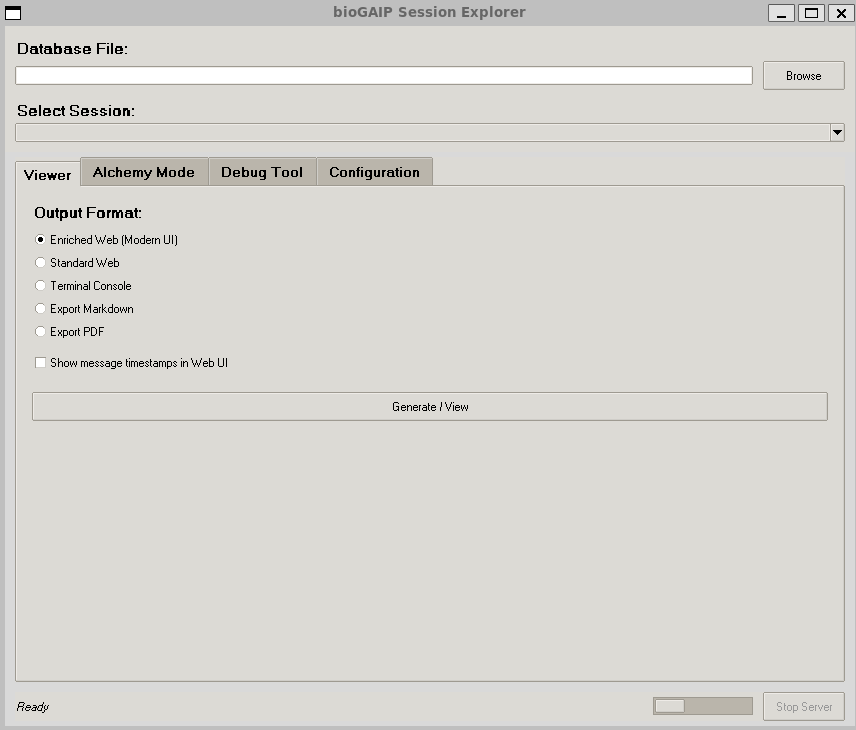
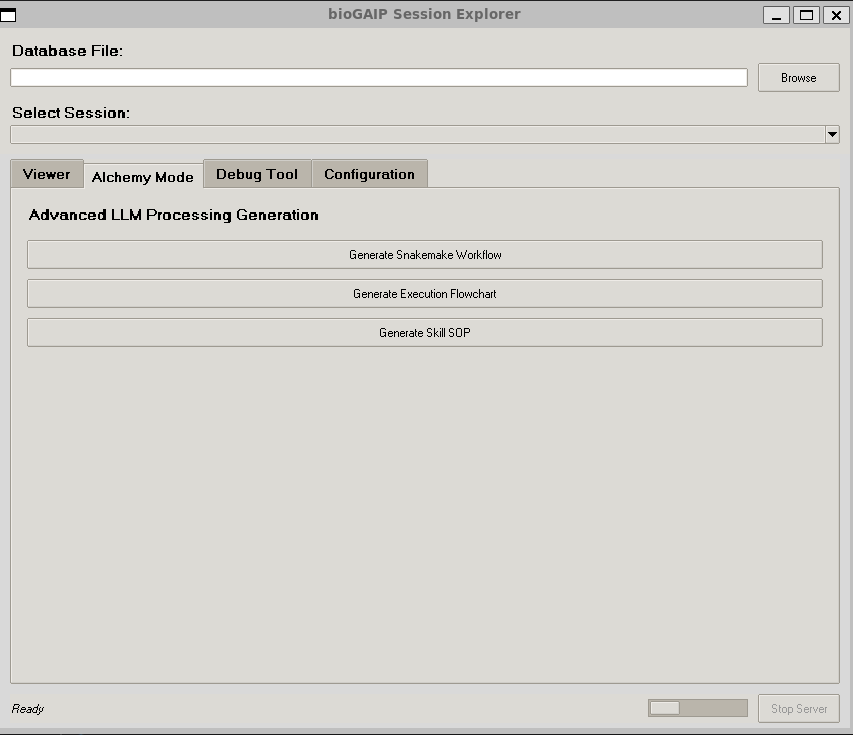
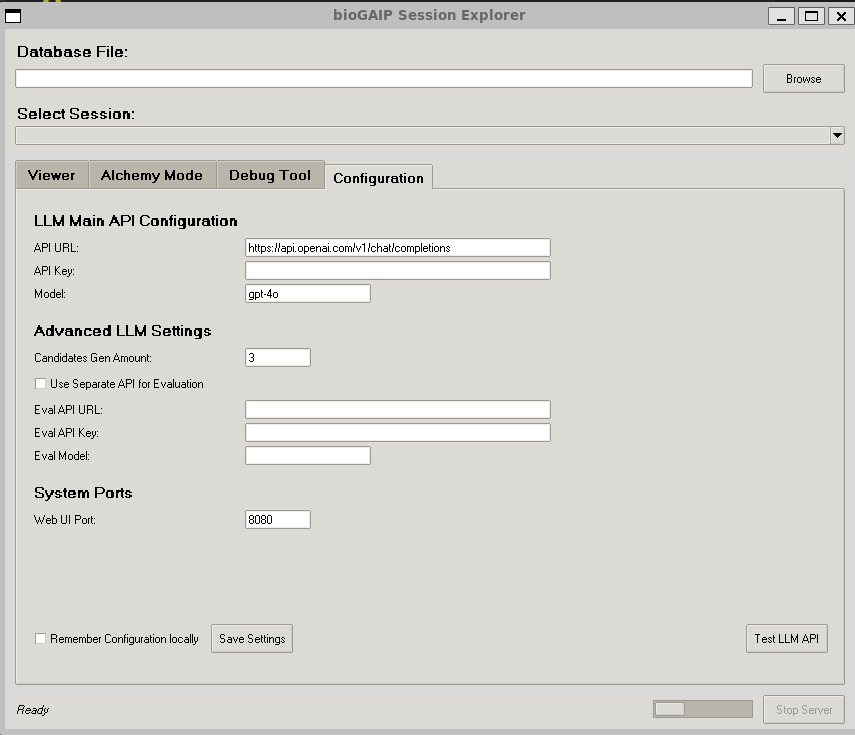

# 🗂️ Session Explorer Suites

The **Session Explorer** is a powerful standalone graphical companion tool for BioGAIP. It allows users to parse, visualize, debug, and repurpose their AI-driven bioinformatics sessions. 

Whether you need to review a past chat log, export an execution trace to PDF, debug raw system logs, or magically transform a session into a reproducible Snakemake pipeline using **Alchemy Mode**, the Session Explorer provides an intuitive interface to handle it all.

---

## 🚀 Getting Started

You can launch the Session Explorer directly from the command line. You can optionally pass the path to a session database (SQLite or JSON) and specify a port for the built-in local web server.

```bash
# Launch the GUI
python session_explorer.py

# Launch with a specific database and port
python session_explorer.py /path/to/kv_sessions.db --port 8080
```

For Windows users, we additionally provide an executable file session_explorer.exe. Users can double-click this file to directly open the main interface of the software.

---

## 🖥️ Graphical Interface Overview

The interface is divided into a global top panel for session selection and a notebook with four main functional tabs: **Viewer**, **Alchemy Mode**, **Debug Tool**, and **Configuration**.

### 1. Global Session Selection
At the top of the window, you can load your session data.
- **Database File:** Click **Browse** to select a BioGAIP SQLite database (`*.db`) or an exported JSON session file (`*.json`).
- **Select Session:** Once loaded, use the dropdown menu to select the specific user session or project key you want to analyze.



---

### 2. Viewer Tab (Session Visualization)
This tab allows you to export or view the selected session history in various formats.

- **Enriched Web (Modern UI):** Launches a local web server and opens a beautiful, modern chat interface in your browser. 
  - *✨ Interactive Explain Feature:* In this mode, every AI response includes a "✨ Explain" button. Clicking it prompts the configured LLM to analyze the context and explain *why* the AI took that specific step.
- **Standard Web:** A clean, lightweight HTML rendering of the session.
- **Terminal Console:** Prints the formatted Markdown history directly to your terminal.
- **Export Markdown / PDF:** Saves the session history as a `.md` or `.pdf` file for easy sharing.


---

### 3. Alchemy Mode Tab (Workflow Generation)
The **Alchemy Mode** is the most advanced feature of the Session Explorer. It utilizes LLMs to analyze your raw chat history and distill it into structured, reproducible assets.

- **Generate Snakemake Workflow:** Extracts all execution steps and translates them into a robust, production-ready `Snakefile`. 
  - *Auto-Validation:* The tool will automatically run a dry-run syntax check (`snakemake --list-rules`) in the background to ensure the generated code is syntactically valid before saving.
- **Generate Execution Flowchart:** Distills the session into a structural DAG and launches an interactive web page. The web view renders a beautiful Mermaid.js flowchart. You can toggle terminal commands on/off, view tooltips, and export the graph as SVG, PNG, or PDF.
- **Generate Skill SOP:** Extracts the methodology from the session to create an "Agent Skill"—a Standard Operating Procedure (SOP) that you can inject into BioGAIP to teach other AI agents how to replicate the workflow.

**🧠 Multi-Candidate Evaluation:** 
For Snakemake and Skill generation, the tool doesn't just ask the LLM once. It generates multiple candidates in parallel (configurable in settings) and uses an AI reviewer to evaluate and select the most robust result.



---

### 4. Debug Tool Tab
A dedicated utility for developers to analyze raw BioGAIP logs (`app.log` or debug `.txt` files).

- **Load Log File:** Parses the log file line by line.
- **Data Table:** Displays structured log entries, separating Timestamp, Action Type, Source, and Content. 
- **Deep Dive:** Double-click any row in the table to open a detailed window revealing the complete JSON payload or raw content for that specific execution step.

---

### 5. Configuration Tab
Before using the *Enriched Web* explanations or any *Alchemy Mode* features, you must configure your LLM settings here.

- **LLM Main API:** Enter your OpenAI-compatible API URL, API Key, and Model Name (e.g., `gpt-4o`).
- **Advanced LLM Settings:**
  - **Candidates Gen Amount:** Set how many concurrent draft versions to generate during Alchemy Mode (Default is 3).
  - **Separate Eval API:** If you want to use a smarter/more expensive model (like `o1-preview`) strictly for *evaluating* the candidates while using a cheaper model for generation, you can configure secondary API credentials here.
- **System Ports:** Modify the port used by the built-in HTTP server.
- **Save Settings:** Check "Remember Configuration locally" to save your keys to a local `biogen_config.json` file. *(Note: Keys are saved in plaintext. Use caution on shared machines.)*

